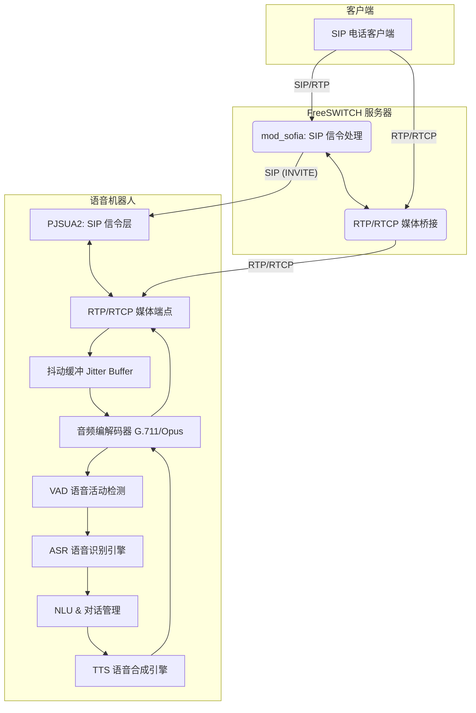
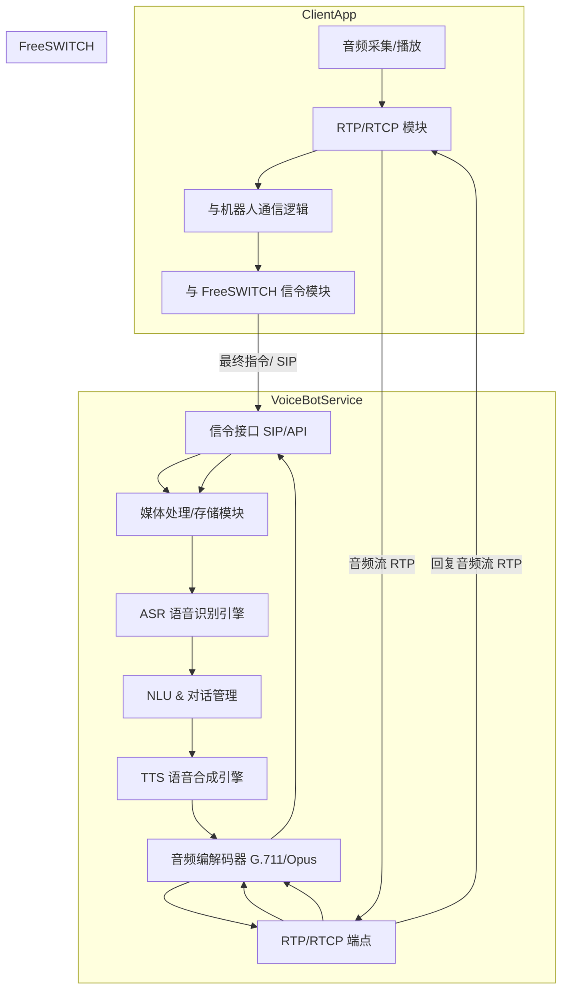
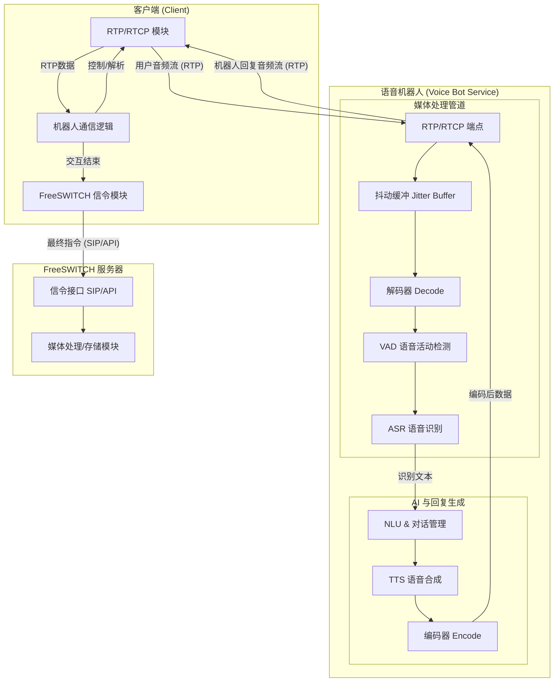

```mermaid
graph TD
    subgraph 客户端
        A[SIP 电话客户端]
    end

    subgraph FreeSWITCH 服务器
        B(mod_sofia: SIP 信令处理)
        C(RTP/RTCP 媒体桥接)
        B <--> C
    end

    subgraph 语音机器人
        D[PJSUA2: SIP 信令层]
        E[RTP/RTCP 媒体端点]
        F[音频编解码器 G.711/Opus]
        G[抖动缓冲 Jitter Buffer]
        H[VAD 语音活动检测]
        I[ASR 语音识别引擎]
        J[NLU & 对话管理]
        K[TTS 语音合成引擎]

        D <--> E
        E --> G --> F --> H --> I --> J --> K --> F --> E
    end

    A -- SIP/RTP --> B
    B -- SIP (INVITE) --> D
    A -- RTP/RTCP --> C
    C -- RTP/RTCP --> E
```
---

```mermaid
graph TD
    subgraph ClientApp
        A[音频采集/播放]
        B[RTP/RTCP 模块]
        C[与机器人通信逻辑]
        D[与 FreeSWITCH 信令模块]
        A --> B
        B --> C
        C --> D
    end

    subgraph VoiceBotService
        E[RTP/RTCP 端点]
        F[音频编解码器 G.711/Opus]
        G[抖动缓冲 Jitter Buffer]
        H[VAD 语音活动检测]
        I[ASR 语音识别引擎]
        J[NLU & 对话管理]
        K[TTS 语音合成引擎]
        E --> F --> G --> H --> I --> J --> K --> F --> E
        E --> F
    end

    subgraph FreeSWITCH
        G[信令接口 SIP/API]
        H[媒体处理/存储模块]
        G --> H
    end

    B -- 音频流 RTP --> E
    E -- 回复音频流 RTP --> B
    D -- 最终指令/ SIP --> G
```
---

```mermaid
graph TD
    subgraph "客户端 (Client)"
        B[RTP/RTCP 模块]
        C[机器人通信逻辑]
        D[FreeSWITCH 信令模块]

        B -- "RTP数据" --> C
        C -- "控制/解析" --> B
        C -- "交互结束" --> D
    end

    subgraph "语音机器人 (Voice Bot Service)"
        subgraph "媒体处理管道"
            direction LR
            E[RTP/RTCP 端点] --> G[抖动缓冲 Jitter Buffer]
            G --> F_dec[解码器 Decode]
            F_dec --> H[VAD 语音活动检测]
            H --> I[ASR 语音识别]
        end
        subgraph "AI 与回复生成"
            direction LR
            J[NLU & 对话管理] --> K[TTS 语音合成]
            K --> F_enc[编码器 Encode]
        end

        I -- "识别文本" --> J
        F_enc -- "编码后数据" --> E
    end

    subgraph "FreeSWITCH 服务器"
        FS_SIG[信令接口 SIP/API]
        FS_MEDIA[媒体处理/存储模块]
        FS_SIG --> FS_MEDIA
    end

    %% 定义连接关系和标签
    B -- "用户音频流 (RTP)" --> E
    E -- "机器人回复音频流 (RTP)" --> B
    D -- "最终指令 (SIP/API)" --> FS_SIG
```